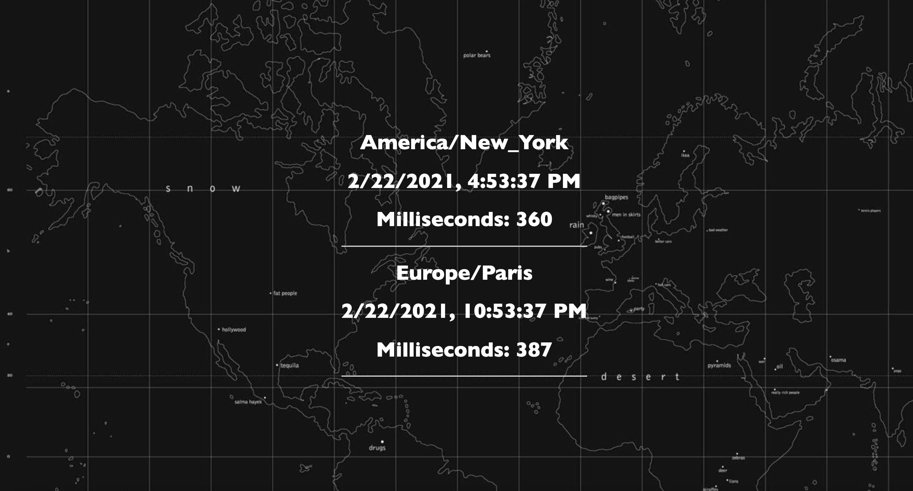

# show-date-time

# Description

This app will show the date and time in New York and Paris.

## Prerequisites

You will need the following things properly installed on your computer.

- [Git](https://git-scm.com/)
- [Node.js](https://nodejs.org/) (with NPM)
- [NPM](https://npmjs.com/)

## Installation

- `git clone https://github.com/YazanAlmatar99/SimpleTimeDate-EmberJS` this repository
- `cd show-date-time`
- `npm run start`

## Running / Development

- `npm run start`
- Visit your app at [http://localhost:8080](http://localhost:8080).

### Building

- `npm build`

## Further Reading / Useful Links

- [glimmerx](http://github.com/glimmerjs/glimmer-experimental/)
- [webpack](https://webpack.js.org/)
- [babel](https://babeljs.io/docs/en/configuration)
